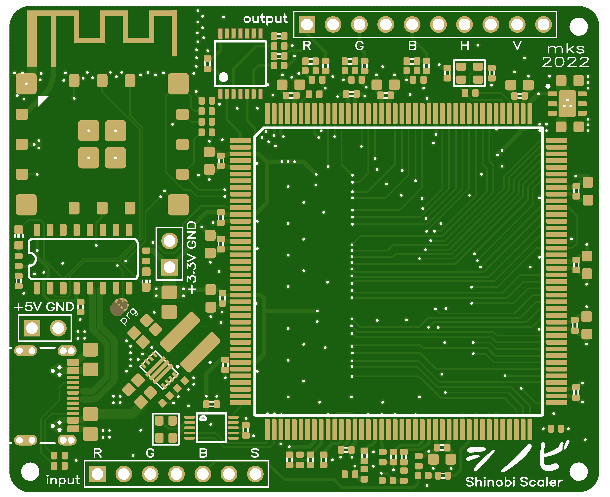
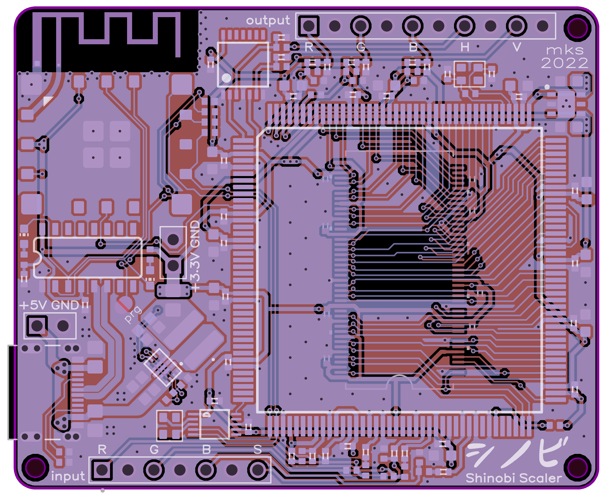
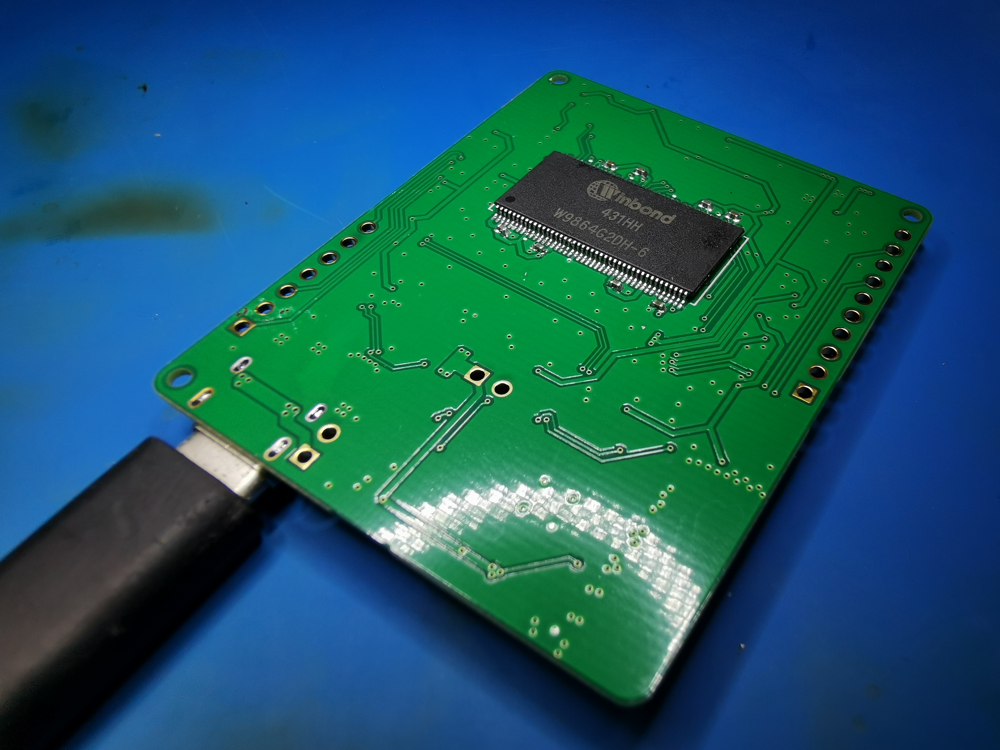
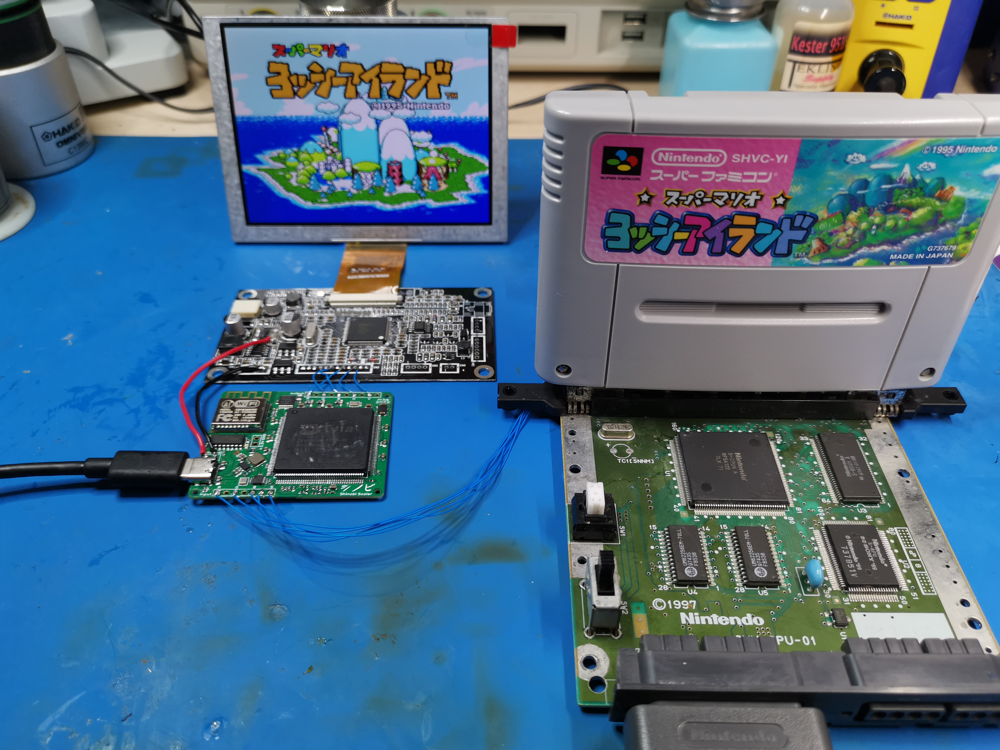
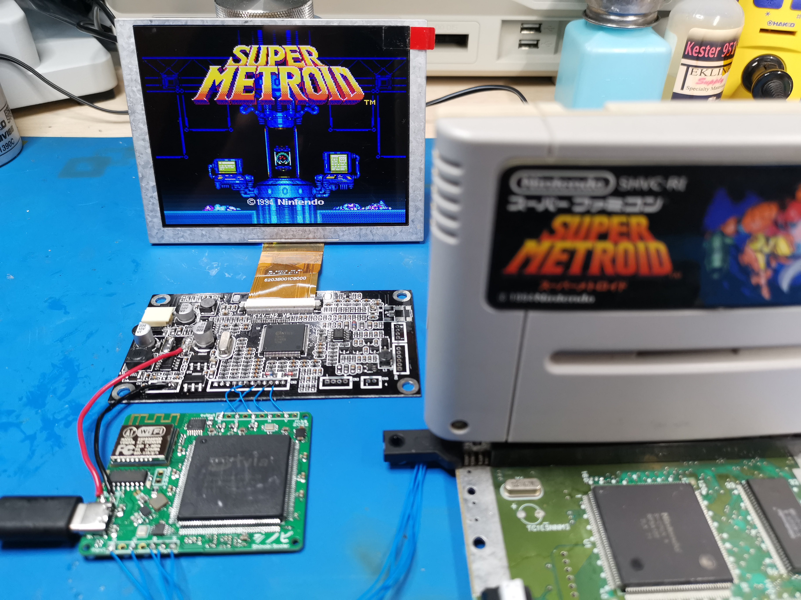
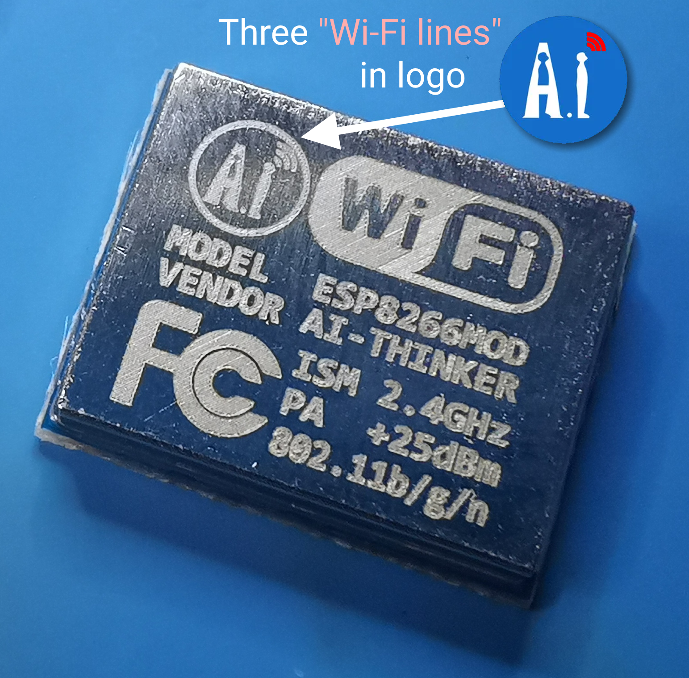
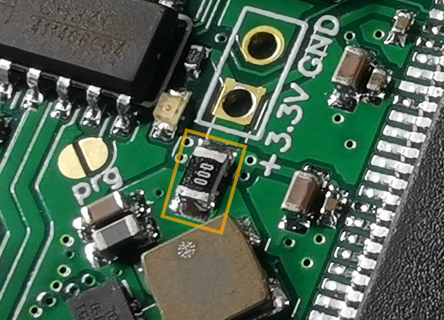
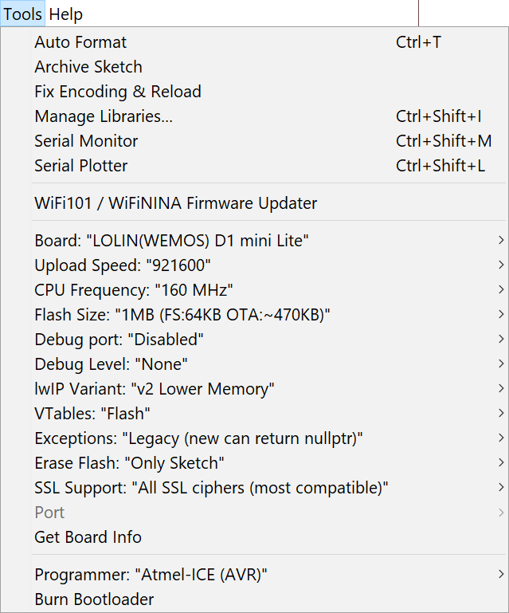

# Shinobi Scaler  
Shinobi is a reimagined, miniaturized GBS8200 for portablizers. Like the original GBS8200, it can convert 240p and 480i RGBs to 480p/720p/960p/1080p VGA, making it perfect for connecting retro video game consoles to modern LCDs.

  

## Features
- [x] 47 x 57mm 2-layer PCB (designed in EAGLE)
- [x] Compatible with [rama's GBS-Control](https://github.com/ramapcsx2/gbs-control)
- [x] 240p/480i RGBs input; 480p/720p/960p/1080p RGBHV/VGA/YPbPr output
- [x] 0.1" PTHs for power and IO (can be mounted with pin headers on a carrier PCB)
- [x] TV5725 scaler IC and 64Mbit SDRAM from GBS8200
- [x] Integrated ESP8266 with PCB antenna
- [x] Integrated CH340C USB-Serial for programming
- [x] Integrated Si5351A clock generator
- [x] Draws 650mA @ 3.3V (2.15W) when scaling 240p to 480p
- [x] Power from 3.3V directly, or supply 4-15V to onboard high-current 3.3V regulator

## Gallery
Shinobi PCB

  

1Chip SNES RGBs upscaled to 640x480 VGA, displayed on ZJ050NA-08C LCD

 

## Ordering
Recommended fabrication specs:
- 1mm-thick 2-layer PCB
- ENIG finish
- Solderpaste stencil for top side highly recommended

**Note:** There are multiple revisions of the ESP-06 (ESP8266 module). Only the most recent revision is compatible with Shinobi. Make sure your ESP-06 has three "Wi-Fi lines" inside the A.I. Thinker logo circle, and that three of the four corner pads are *not* connected to GND. 

  

I maintain a [Mouser project](https://www.mouser.com/ProjectManager/ProjectDetail.aspx?AccessID=a0a4651c6a) with most of the BOM. You will still need to source a TV5725, ESP-06, and CH340C elsewhere. Cheap GBS8200s are available from AliExpress, eBay, DHGate, and Amazon if you'd like to harvest the TV5725 and SDRAM from one. I get my [TV5725s](https://www.aliexpress.us/item/2251832712259245.html), [ESP-06s](https://www.aliexpress.us/item/2251832641491582.html) and [CH340Cs](https://www.aliexpress.com/wholesale?&SearchText=ch340c) from AliExpress.

**Update (11/3/22):** ESP-06s have been relisted on the AliExpress Keli-te Store.

**Update (1/25/23):** TPS621351RGXR is available for purchase on TI's website.

## Assembly
I've provided an [iBOM](https://github.com/oratek-ch/InteractiveBOM) file to make assembly easier. The online iBOM viewer is down, so you'll have to download the [local version of iBOM](https://github.com/oratek-ch/InteractiveBOM/blob/master/Release/V1_6.zip).

As mentioned previously, you can harvest the TV5725 and SDRAM from a GBS-8200 if you'd like. Please note that previous advice to harvest the 0603 ferrite beads from the GBS-8200 is outdated. Use 220Ω @ 100MHz 0402 ferrite beads as called out in the BOM.

**Note:** There is an 0805 zero-ohm resistor (R19) in series with the output of the onboard 3.3V regulator. If you intend to power Shinobi from an external 3.3V supply, you can omit this resistor to avoid backfeeding the onboard 3.3V regulator. If you choose to remove the zero-ohm and/or U7 (TPS621351), the board will need to be powered with an external 3.3V supply during programming. 

## Programming
- Install [CH340 drivers](http://www.wch-ic.com/downloads/CH341SER_ZIP.html)
- Bridge the `prg` jumper with solder (or tweezers)
- Plug USB-C into Shinobi. **Note:** USB-C port works in both orientations on the latest board rev.
- Verify COM port (or your platform's equivalent) is enumerating
- Open GBS-Control release of your choice in Arduino IDE (these steps assume you have already installed requisite libraries, etc.)
- Set up Tools menu as shown, select CH340C port under Port menu, then program

- When programming is complete, unplug Shinobi, unbridge `prg`, and power back up to access GBS-Control Wi-Fi AP

## To-do
- [ ] Finish prototype enclosure and upload photos + MCAD files
- [ ] Run reliability tests for higher output resolutions (currently only 480P has been vetted)

## License

 This work is licensed under a <a rel="license" href="http://creativecommons.org/licenses/by/4.0/">Creative Commons Attribution 4.0 International License</a>.

Share — copy and redistribute the material in any medium or format  
Adapt — remix, transform, and build upon the material for any purpose, even commercially.  
Attribution — You must give appropriate credit, provide a link to the license, and indicate if changes were made.  
